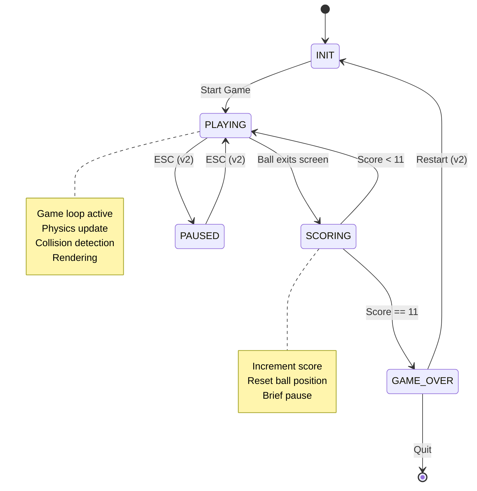
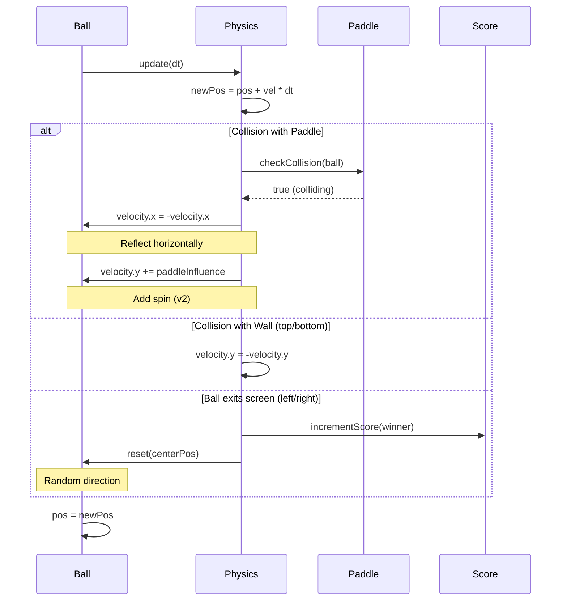

# Game 01 - PONG

## Vue d'Ensemble

**Pong** est le jeu fondateur du jeu vidéo (1972).
Deux raquettes, une balle, des règles ultra-simples.

Ce premier jeu établit les patterns fondamentaux :
- Game loop déterministe
- Physique 2D basique
- Collisions rectangle/rectangle
- Input responsive
- Scoring simple

## Layout Spatial

```
┌────────────────────────────────────────────────────────────────┐
│                         800 x 600 px                           │
├────────────────────────────────────────────────────────────────┤
│                                                                │
│  ║                                                        ║    │
│  ║                                                        ║    │
│  ║ P1                       ●                         P2 ║    │
│  ║ (x=20)                 BALL                    (x=780)║    │
│  ║                      (radius=8)                       ║    │
│  ║                                                        ║    │
│  ║                                                        ║    │
│  ║                                                        ║    │
│                                                                │
│  Paddle: 15×80 px          Score: P1  0 - 0  P2              │
│                                                                │
└────────────────────────────────────────────────────────────────┘
  ↑ Zone score gauche               Zone score droite ↑
  (x=0)                                           (x=800)
```

## Règles du Jeu

### Objectif

Marquer 11 points avant l'adversaire.

### Gameplay

1. **Balle** : Part du centre, se déplace en ligne droite
2. **Raquettes** : Contrôlées par les joueurs, mouvement vertical uniquement
3. **Rebond** : La balle rebondit sur les murs haut/bas et les raquettes
4. **Point** : Quand la balle sort par la gauche ou droite
5. **Relance** : Après chaque point, balle repart du centre
6. **Victoire** : Premier à 11 points

### Physique

```
Balle:
  - Vitesse constante : 300 pixels/sec
  - Angle de rebond = angle d'incidence (réflexion parfaite)
  - Variation d'angle selon point d'impact sur raquette (optionnel v2)

Raquette:
  - Vitesse : 400 pixels/sec
  - Mouvement : Haut/Bas uniquement
  - Bloquée par les bords écran
```

### Contrôles

```
Joueur Gauche (P1):
  W = Haut
  S = Bas

Joueur Droite (P2):
  UP   = Haut
  DOWN = Bas

Commun:
  ESC   = Quitter
  SPACE = Pause/Resume (optionnel v2)
```

## Diagramme d'États (FSM)



## Séquence Gameplay : Collision Ball/Paddle



## Spécifications Techniques

### Espace de Jeu

```
Résolution : 800×600 pixels
Origine : (0, 0) en haut à gauche

Terrain:
  Largeur : 800 px
  Hauteur : 600 px
  Murs : haut (y=0), bas (y=600)
  Zones de score : gauche (x=0), droite (x=800)
```

### Entités

```cpp
Ball:
  Position : (x, y) float
  Velocity : (vx, vy) float
  Radius : 8 px

Paddle:
  Position : (x, y) float  // y = centre
  Width : 15 px
  Height : 80 px
  Speed : 400 px/s

GameState:
  scoreLeft : int [0..11]
  scoreRight : int [0..11]
  ballActive : bool
  winner : std::optional<Player>
```

### Collisions

```
Ball <-> Mur (haut/bas):
  - Inverser velocity.y
  - Garder velocity.x

Ball <-> Paddle:
  - Inverser velocity.x
  - Modifier légèrement velocity.y selon point d'impact (v2)

Ball <-> Zone de score:
  - Incrémenter score adversaire
  - Réinitialiser balle au centre
  - Direction aléatoire (ou vers perdant)
```

### États du Jeu

```
1. INIT       : Initialisation, attente start
2. PLAYING    : Jeu actif, game loop
3. SCORING    : Point marqué, pause brève
4. PAUSED     : Jeu en pause (optionnel v2)
5. GAME_OVER  : Victoire détectée
```

## Versions Incrémentales

### Version 0.1 : Balle Libre
- Balle se déplace en ligne droite
- Rebondit sur murs haut/bas
- Pas de raquettes, pas de score
- **Objectif** : Valider game loop + physique basique

### Version 0.2 : Une Raquette
- Ajouter raquette gauche (P1)
- Input clavier (W/S)
- Collision ball/paddle
- **Objectif** : Input system + collisions

### Version 0.3 : Pong Complet
- Deuxième raquette (P2)
- Scoring fonctionnel
- Détection de victoire
- **Objectif** : Jeu jouable à 2

### Version 0.4 : Polish
- Améliorer feedback visuel
- Sons (optionnel)
- Menu et pause (optionnel)
- **Objectif** : Game feel

## Métriques de Succès

### Fonctionnel
- [ ] Balle rebondit correctement
- [ ] Raquettes répondent instantanément
- [ ] Score s'incrémente correctement
- [ ] Victoire détectée à 11 points
- [ ] Aucun bug de collision

### Performance (HW_BASELINE)
- [ ] 60 FPS stable
- [ ] Update < 2 ms
- [ ] Render < 8 ms
- [ ] 0 allocations en frame
- [ ] < 10 MB mémoire totale

### Qualité Code
- [ ] 100% des comportements testés
- [ ] Complexité cyclomatique < 5
- [ ] Séparation core/rendering claire
- [ ] Déterminisme complet (replay possible)

## Extensions Futures (Hors Scope v1)

- IA pour joueur solo
- Variations de vitesse de balle
- Power-ups
- Effets visuels (trails, particles)
- Son et musique
- Menu et options

## Références

- Pong original (Atari, 1972)
- [Pong Physics Analysis](https://en.wikipedia.org/wiki/Pong)

---

**Status** : Draft
**Date** : 2025-11-11
**Version** : 1.0
